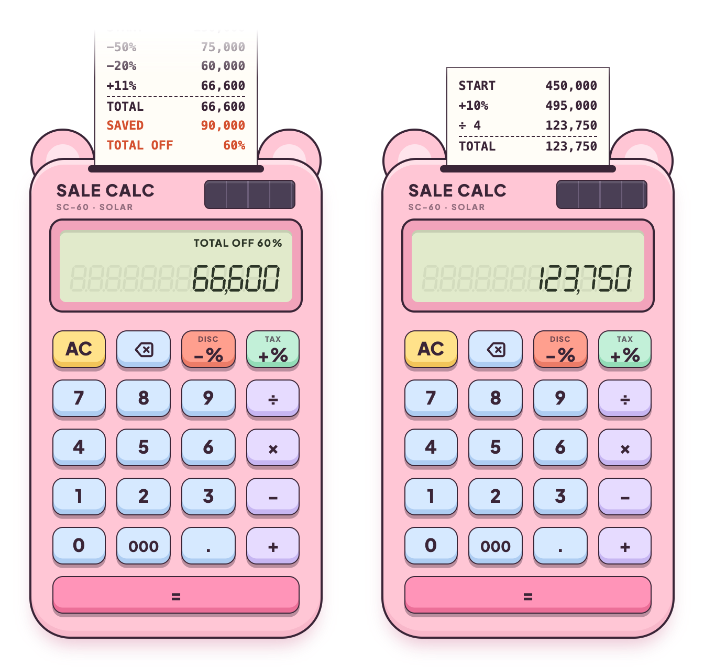

# 🧮 Sale Calc

A tiny pink calculator for **shopping math**. Stack discounts, add tax or a service charge, and split the bill while a little paper tape prints every step, so you can see that 50% off plus another 20% off is really **60% off**, not 70%. It runs in any modern browser, and it also builds into a small macOS app where only the calculator floats on your desktop.



## Try it

```bash
git clone https://github.com/GianneAngely/sale-calc.git
```

Open `index.html` in a browser. The font lives inside that one file, so it works offline.

## Build the macOS app

You need macOS and the Xcode Command Line Tools (`xcode-select --install`).

```bash
cd sale-calc/mac
./build.sh
```

This puts **Sale Calc.app** in `/Applications`. Drag the calculator by its body or the paper tape, press `⌘W` to hide it, and press `⌘Q` to quit.

## What's inside

- **−% and +%** — take a percentage off the running total, or add one for tax and service
- **Paper tape** — every step prints with its running total, plus how much you saved and the real combined discount
- **Total off** — the display shows the combined discount while you stack them
- **Everyday math** — plus, minus, times, divide, and a `000` key for long Rupiah prices
- **Keeps the tape** — reload or reopen, and your last calculations are still there

## Controls

| Key | Keyboard | Action |
| --- | --- | --- |
| AC | `Esc` | Clear everything and tear off the tape |
| ⌫ | `Backspace` | Delete the last digit |
| −% | `%` or `D` | Take a percentage off |
| +% | `T` | Add a percentage (tax, service) |
| ÷ × − + | `/` `*` `-` `+` | Everyday math |
| = | `Enter` | Total |

## Built with

HTML · CSS · vanilla JavaScript, plus Swift and WKWebView for the macOS app. The seven-segment digits are drawn as SVG, so the display stays crisp at any size. No libraries and no build step for the web version.

The typeface is [Plus Jakarta Sans](https://fonts.google.com/specimen/Plus+Jakarta+Sans) (SIL Open Font License), embedded in the page.
